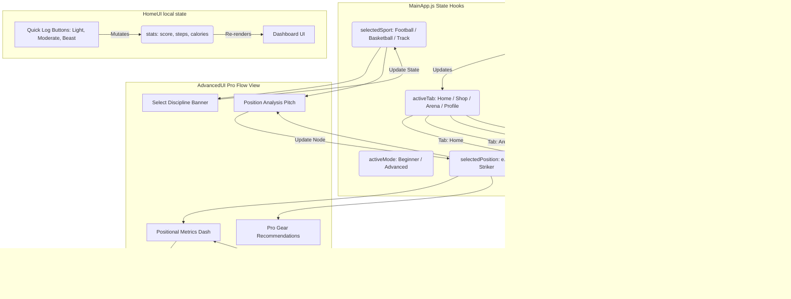

```mermaid

graph TD
    %% Main Application State
    subgraph App_State_Management [MainApp.js State Hooks]
        A1("activeTab: Home / Shop / Arena / Profile")
        A2("activeMode: Beginner / Advanced")
        A3("selectedSport: Football / Basketball / Track")
        A4("selectedPosition: e.g., Striker")
    end

    %% Navigation Bar
    Nav[Bottom Navigation Bar] -- Updates --> A1

    %% Top Level Routing based on Active Tab
    A1 -- "Tab: Home" --> H[HomeUI]
    A1 -- "Tab: Arena" --> Ar[ArenaUI]
    A1 -- "Tab: Profile" --> P[ProfileUI]
    A1 -- "Tab: Shop" --> S{Active Mode?}

    %% Shop Routing
    S -- "Beginner" --> B[BeginnerUI]
    S -- "Advanced" --> Adv[AdvancedUI]

    %% Advanced UI Data Flow
    subgraph Shop_Pro_Flow [AdvancedUI Pro Flow View]
        D1[Select Discipline Banner]
        D2[Position Analysis Pitch]
        D3[Positional Metrics Dash]
        D4[Pro Gear Recommendations]

        A3 --> D1
        D1 -- "Update State" --> A3
        
        A3 --> D2
        A4 --> D2
        D2 -- "Update Node" --> A4
        
        A4 --> D3
        D3 -- "Maps Agi, Pow, Sta, Vis" --> D3
        
        A4 --> D4
    end

    %% Home Logging Flow
    subgraph Home_Analytics [HomeUI local state]
        H_Stats("stats: score, steps, calories")
        H_Log[Quick Log Buttons: Light, Moderate, Beast]
        
        H_Log -- "Mutates" --> H_Stats
        H_Stats -- "Re-renders" --> H_Display[Dashboard UI]
    end
```

